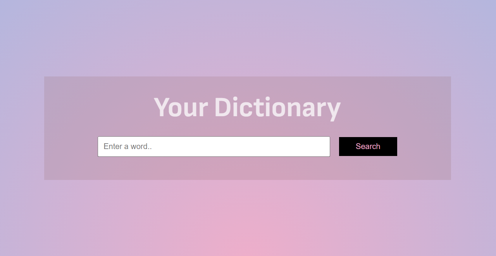

# JavaScript Dictionary

A simple and efficient dictionary application built with JavaScript that leverages an API to provide definitions, synonyms, antonyms, and more.

## Features

- Search for words and retrieve definitions
- Get synonyms and antonyms
- Responsive design for mobile and desktop
- Easy to use interface

## Technologies Used

- HTML
- CSS
- JavaScript
- Fetch API (for API requests)

## API Used

This project uses the https://dictionaryapi.dev/ for fetching word data.
